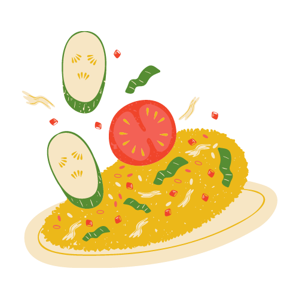

# Recipe  [![Codemagic build status][hello-world]][latest-build]
A multi-platform app that targets mobile, web, and desktop using the Flutter framework.

# Goals
 **Collaboration** is the  first and foremost goal of this project, followed by:
- Creating a showcase for the [Typsense dart client][pub] by using the existing indexed data of the [recipe-search showcase][recipe-search] for the search feature.
- Achieving maximum code reusability across the supported platforms.
- CI/CD using [Codemagic][codemagic].

# Non-Goals
Since the project is focused solely on the search functionality, not much emphasis would be given to:
- UI/UX
- Themes

Check out [Discussions tab][discuss] tab to follow the progress of the project.

# Running tests
Use the following command to generate the mock files before running tests:

`dart run build_runner build`

[pub]: https://pub.dev/packages/typesense
[recipe-search]: https://recipe-search.typesense.org
[codemagic]: https://flutterci.com/
[hello-world]: https://api.codemagic.io/apps/60f461de0c5097d1ca736815/test/status_badge.svg
[latest-build]: https://codemagic.io/apps/60f461de0c5097d1ca736815/test/latest_build
[discuss]: https://github.com/happy-trains/flutter-recipe/discussions
