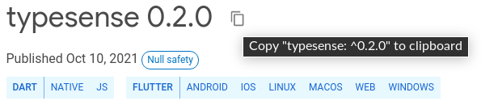
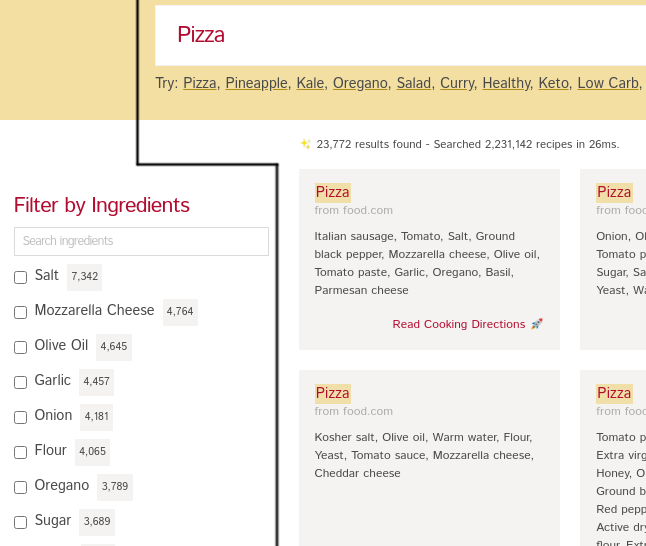
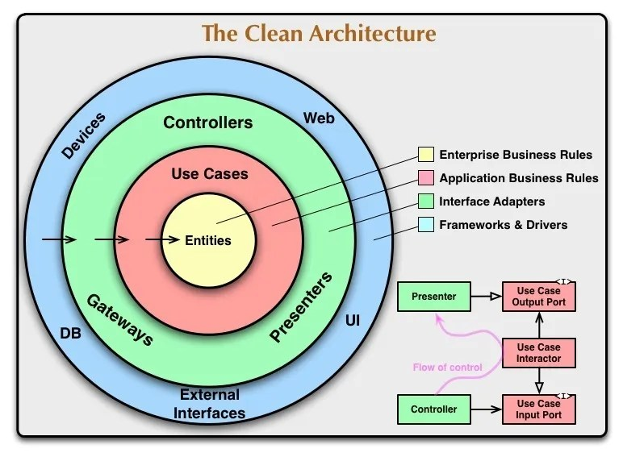
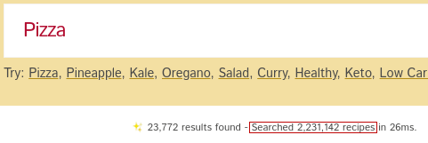

So you’ve heard about how awesome Typesense is and you happen to be a Flutter developer. You’ve landed on the right place, we’re going to build a [sample mobile app](https://play.google.com/store/apps/details?id=dev.happysan.recipe) inspired by [this showcase](https://recipe-search.typesense.org/)  using the dart package [typesense](https://pub.dev/packages/typesense). Follow along to experience the awesomeness. 


# Prerequisite

Let’s list the typesense package in `pubspec.yaml` as a dependency.


Run

```bash
$ flutter pub add typesense
```

Or 

get the latest version from [pub.dev](https://pub.dev/packages/typesense)



and paste it here

```yaml
environment:
  sdk: ">=2.14.0 <3.0.0"

dependencies:
  flutter:
    sdk: flutter
  typesense: ^0.2.0
```

# Planning



By eyeballing, we can notice there are two sub-features here.
* The search box that accepts a query and the results that it produces.
* Filtering the previous result by ingredients.

We’ll be focusing on the first half of the story in this article.
The search box would be a [text field](https://api.flutter.dev/flutter/material/TextField-class.html)  where the user can type in the query. Notice that we get results for each keystroke instead of typing in the query and then pressing a search button to get results. So our search function would be fired [as the query is changed](https://api.flutter.dev/flutter/material/TextField/onChanged.html) by the user.

The `search stats` just below the search bar can be easily extracted from the response of the `collection/<collection_name>/documents/search` api. 

```json
{
   "facet_counts": [
     {
       "counts": [
         {"count": 8277, "highlighted": "salt", "value": "salt"}
       ],
       "field_name": "ingredient_names",
       "stats": {}
     }
   ],
   "found": 7514,
   "hits": [
     {
       "document": {
         "directions": [
           "Follow directions on hot roll mix, using 1 cup warm water and no egg; do not let rise.",
           "On a greased baking sheet, roll dough out to 2 12-inch circles.",
           "Pinch edge so that it stands up.",
           "Brush dough with thin coating of oil.",
           "In a skillet, break up sausage into small pieces and brown slowly, stirring often.",
           "Drain fat.",
           "Drain and slice tomatoes, reserving 1/2 cup liquid.",
           "Place tomatoes on dough; sprinkle with salt and pepper, cover with mozzarella cheese, and drizzle each pizza with 1 Tblsp.",
           "olive oil.",
           "Sprinkle with sausage.",
           "Combine tomato paste, reserved tomato juice, garlic, and herbs; spread over sausage.",
           "Sprinkle with salt and pepper and parmesan cheese.",
           "Drizzle with 1 Tblsp.",
           "olive oil for each pizza.",
           "Bake at 450* for 20 minutes or until crust is done."
         ],
         "id": "2230607",
         "ingredient_names": [
           "Italian sausage",
           "tomato",
           "salt",
           "ground black pepper",
           "mozzarella cheese",
           "olive oil",
           "tomato paste",
           "garlic",
           "oregano",
           "basil",
           "parmesan cheese"
         ],
         "ingredients_with_measurements": [
           "1 (16 ounce) package hot roll mix",
           "1 lb Italian sausage",
           "1 lb canned tomato (2 cups)",
           "salt, to taste",
           "fresh coarse ground black pepper, to taste",
           "6 ounces mozzarella cheese, grated",
           "6 tablespoons olive oil",
           "1 (6 ounce) can tomato paste (2/3 cup)",
           "2 garlic cloves, minced",
           "1 tablespoon oregano, crushed",
           "1 tablespoon basil, crushed",
           "14 cup grated parmesan cheese"
         ],
         "link": "http://www.food.com/recipe/pizza-355227",
         "recipe_id": 2230607,
         "title": "Pizza"
       },
       "highlights": [
         {
           "field": "title",
           "matched_tokens": ["Pizza"],
           "snippet": "<mark>Pizza</mark>"
         }
       ],
       "text_match": 33514500
     }
   ],
   "out_of": 2231142,
   "page": 1,
   "request_params": {
     "collection_name": "recipes_1630513346",
     "per_page": 1,
     "q": "Pizza"
   },
   "search_time_ms": 117
 }
```
We’re interested in `found`, `out_of` and `search_time_ms` fields.

Which brings us to the highlight of this article, list of recipes. The search api returns a list of documents in the `hits` field that match the given query, in our case, list of recipes. We’ll be using it to build a list of corresponding widgets.

# Let’s start coding

We'll be following [Clean architecture guide](https://resocoder.com/flutter-clean-architecture-tdd/) by [Reso Coder](https://github.com/resocoder). Throughout building this app Test Driven Development is also followed ([accompanying tests](../test)). 



Our app only has a single feature [`search_recipe`](../lib/features/search_recipe). Following clean architecture, we'll be splitting it into three distinct parts.

* [`domain`](../lib/features/search_recipe/domain) - Entities, Use Cases and Repository Contract (yellow and pink layers)
* [`data`](../lib/features/search_recipe/data) - Models, Repository, Data Sources (green layer)
* [`presentation`](../lib/features/search_recipe/presentation) - bloc, Flutter UI (green and blue layer)


## Domain

Domain contains the business rules. It is the most stable part of our whole architecture in that it does not depend upon any particular framework/package, unless we're changing what the core functionality of our app would be. If our app allows user to search for recepie, it is expected to do the same whether we use Flutter or React Native.

### Entities
We’ll start coding from the innermost layer of our architecture i.e. Entities. Entities represent the structure of our data. 

Following the response of the Typesense api, let’s create the most significant entity first, [`Recipe`](../lib/features/search_recipe/domain/entities/recipe.dart). It declares fields for each corresponding field in the `document` object of the response.

```dart
class Recipe extends Equatable {
 final List<String> directions;
 final String id;
 final List<String> ingredientNames;
 final List<String> ingredientsWithMeasurements;
 final String link;
 final int recipeId;
 final String title;
 
 // ...

 String get authority => Uri.parse(link).authority.replaceFirst('www.', '');

 // ...

}
```

The `authority` getter would be used to display the website name where the particular recipe is from. Similarly, we’ll create the rest of the [entities](../lib/features/search_recipe/domain/entities/).

Now let’s create the contract(abstract class) of the [repository](../lib/features/search_recipe/domain/repositories/search) that our use cases would depend upon.

### Repository Contract

```dart
abstract class RecipesRepository {
 Future<Either<Failure, Result>> search({
   required String query,
   required List<String> queryBy,
   required int pageNumber,
   FilterModel? filter,
   List<String>? facetBy,
   int? maxFacetValues,
   int? perPage,
 });
 
 Future<Either<Failure, int>> getIndexSize();
}
```
This abstract class defines a contract that the class extending it must fulfill.

```dart

abstract class Failure extends Equatable {
  // ...

```

### Use Cases

Both the use cases, [`SearchRecipes`](../lib/features/search_recipe/domain/usecases/search_recipes.dart) and [`GetIndexSize`](../lib/features/search_recipe/domain/usecases/get_index_size.dart), depend on the repository to handle the interaction with the environment, either Networking or Local Storage. This technique of depending on a contract rather than the concrete implementation enables seamless changes/updation of environment facing code with no changes required in our app logic. For example, our `GetIndexSize` usecase

```dart
class GetIndexSize implements UseCase<int, NoParams> {
 final RecipesRepository repository;
 
 GetIndexSize(this.repository);
 
 @override
 Future<Either<Failure, int>> call(NoParams params) =>
     repository.getIndexSize();
}
```
wouldn’t need to be updated if down the line we decide to use the `http` package instead of `typesense`. Similarly we’ll implement `SearchRecipes` usecase.

Implementing `call` function allows us to allow an instance of our class to be called like a function. 

```dart
class PrintResponse {
  String call() => 'Call directly';
}

void main() {
  final printResponse = PrintResponse();
  print(printResponse());
}
```

This snippet would print `Call directly`.

> It is discouraged to use `call` method since
> * A class should be a noun (`Person`) and it should have methods that should be verbs (`chillOut`). 
> * Instances of Callable classes [are not actually callable](https://recipes.tst.sh/docs/faq/type-system.html#callable-classes).
> 
> Exsiting code would be updated into following
>
>```dart
>abstract class UseCase<Type, Params> {
>  Future<Either<Failure, Type>> execute(Params params);
>} 
>```
>```dart
>class GetIndexSizeUseCase implements UseCase<int, NoParams> {
> final RecipesRepository repository;
> 
> GetIndexSize(this.repository);
> 
> @override
> Future<Either<Failure, int>> execute(NoParams params) =>
>     repository.getIndexSize();
>}
>```

Learn more about what’s happening with `implements UseCase<A, B>` [here](https://resocoder.com/2019/09/02/flutter-tdd-clean-architecture-course-3-domain-layer-refactoring/#UseCase_Base_Class).

> More sound approach to having the same effect as `getIndexSize(NoParams())`, without having to pass in an object to denote no parameters, is the following inheritance tree:
>
>```dart
>abstract class UseCase {}
>
>abstract class NoParamsUseCase<T> extends UseCase {
>  T execute();
>}
>
>abstract class ParamsUseCase<T, P> extends UseCase {
>  T execute(P params);
>}
>
>class GetIndexSizeUseCase<T> extends NoParamsUseCase<T> {
>  @override
>  T execute() {
>    // ...
>  }
>}
>
>class SearchRecipes<T, P> extends ParamsUseCase<T, P> {
>  @override
>  T execute(P params) {
>    // ...
>  }
>}
>```
>
>Future code would be updated accordingly.

## Data

Now that we’ve completed coding our domain part, we’ll get started with the data part of our application. It hosts the code that deals with the environment.

### Models

 Since the search api provided by typesense responds with json data, we’ll need a way to convert the json reponse to entities we’ve defined in the domain. We’ll be implementing model classes that would extend corresponding entities and add deserialization logic in them. We didn't add this logic directly into the entities since the data representation can change. The api might start returning XML response in the future. We wouldn't want to alter our domain because of enviromnental changes. Let’s create [`RecipeModel`](../lib/features/search_recipe/data/models/recipe_model.dart) first.

```dart
class RecipeModel extends Recipe {
 const RecipeModel({
   required List<String> directions,
   // ...
   required String title,
 }) : super(
           directions: directions,
           // ...
           title: title);
 
 factory RecipeModel.fromJson(Map<String, dynamic> json) {
   var _link = json['link'];
   if (!_link.startsWith('http')) {
     _link = 'http://$_link';
   }
 
   return RecipeModel(
     directions: json['directions'].cast<String>(),
     id: json['id'],
     ingredientNames: (json['ingredient_names'] as List)
         .cast<String>()
         .map((i) => '${i[0].toUpperCase()}${i.substring(1)}')
         .toList(),
     ingredientsWithMeasurements:
         json['ingredients_with_measurements'].cast<String>(),
     link: _link,
     recipeId: json['recipe_id'],
     title: json['title'],
   );
 }
 
  static const empty = Recipe(
    directions: [],
    id: '',
    ingredientNames: [],
    ingredientsWithMeasurements: [],
    link: '',
    recipeId: 0,
    title: '',
  );

 Map<String, dynamic> toJson() {
   return {
     'directions': directions,
     'id': id,
     'ingredient_names': ingredientNames,
     'ingredients_with_measurements': ingredientsWithMeasurements,
     'link': link,
     'recipe_id': recipeId,
     'title': title,
   };
 }
}
```

In the recipes dataset there are some links that don’t have a scheme like, `http://`. This makes [`Uri`](https://api.dart.dev/stable/2.15.0/dart-core/Uri-class.html) unable to parse `authority` correctly that we need to show in the recipe widget


[`url_launcher`](https://pub.dev/packages/url_launcher) package is also unable to launch such links. So we’re fixing this by appending `http://` to them

```dart
   if (!_link.`startsWith('http')) {
     _link = 'http://$_link';
   }
```

We’re not appending `https://` because if the website doesn’t support `https`, no connection might be established, thus it would break our functionality of launching urls. By appending `http://` we’re letting the website handle the redirection, if one is set up, to `https://` much like how `www` version of the site is redirected to `non-www` counterpart, or vice-versa. We’re also capitalizing the first letter of ingredient names received in the response.

```dart
     (json['ingredient_names'] as List)
         .cast<String>()
         .map((i) => '${i[0].toUpperCase()}${i.substring(1)}')
         .toList(),
```

The `empty` property would come in handy while implementing the initial state of our bloc. We’ve also set up `toJson` in `RecipeModel` so we could serialize the object and store it in local storage using [`shared_preferences`](https://pub.dev/packages/shared_preferences) for caching. Similarly we’ll implement rest of the [models](../lib/features/search_recipe/data/models/). 

### Repository

Let’s now move our focus to the implementation of the Repository contract present in the domain layer. We’ll create [`RecipesRepositoryImpl`](../lib/features/search_recipe/data/repositories/recipes_repository_impl.dart)

```dart
class RecipesRepositoryImpl implements RecipesRepository {
 final RecipesRemoteDataSource remoteDataSource;
 final RecipesLocalDataSource localDataSource;
 final NetworkInfo networkInfo;
 
 RecipesRepositoryImpl({
   required this.remoteDataSource,
   required this.localDataSource,
   required this.networkInfo,
 });
 
 @override
 Future<Either<Failure, Result>> search({
   required String query,
   required List<String> queryBy,
   required int pageNumber,
   FilterModel? filter,
   List<String>? facetBy,
   int? maxFacetValues,
   int? perPage,
 }) async {
   if (await networkInfo.isConnected) {
     try {
       final result = await remoteDataSource.search(
         query: query,
         queryBy: queryBy,
         pageNumber: pageNumber,
         filter: filter,
         facetBy: facetBy,
         maxFacetValues: maxFacetValues,
         perPage: perPage,
       );
 
       localDataSource.cacheResult(result);
       return Right(result);
     } on ServerException {
       return Left(ServerFailure());
     }
   } else {
     try {
       return Right(await localDataSource.getLastResult());
     } on CacheException {
       return Left(CacheFailure());
     }
   }
 }
 
 @override
 Future<Either<Failure, int>> getIndexSize() async {
   if (await networkInfo.isConnected) {
     try {
       final indexSize = await remoteDataSource.getIndexSize();
 
       localDataSource.cacheIndexSize(indexSize);
       return Right(indexSize);
     } on ServerException {
       return Left(ServerFailure());
     }
   } else {
     try {
       return Right(await localDataSource.getLastIndexSize());
     } on CacheException {
       return Left(CacheFailure());
     }
   }
 }
}
```

`RecipesRepositoryImpl` returns the exception/response in the form of `Either<Left, Right>`. If no exception occurs, conventionally, the response is returned in the right part of `Either`. Otherwise the exception is converted to a failure and returned in the left part.

### Data source and Network

 Our repository implementation delegates the fulfillment of requests to remote source [`RecipesRemoteDataSource`](../lib/features/search_recipe/data/datasources/recipes_remote_data_source.dart) or local source [`RecipesLocalDataSource`](../lib/features/search_recipe/data/datasources/recipes_local_data_source.dart) depending on the internet connectivity info from [`NetworkInfo`](../lib/core/network/network_info.dart).

 All these dependencies are abstract classes too. `NetworkInfo` declares a `isConnected` getter depending on whose value we use either `RecipesRemoteDataSource` or `RecipesLocalDataSource`.

```dart
abstract class NetworkInfo {
 Future<bool> get isConnected;
}
```
 
`RecipesRemoteDataSource` declares `search` and `getIndexSize` functions.

```dart
abstract class RecipesRemoteDataSource {
 /// Searches the collection for [query].
 ///
 /// Throws a [ServerException] for all error codes.
 Future<ResultModel> search({
   required String query,
   required List<String> queryBy,
   required int pageNumber,
   FilterModel? filter,
   List<String>? facetBy,
   int? maxFacetValues,
   int? perPage,
 });
 
 /// Gets the number of documents in the collection.
 ///
 /// Throws a [ServerException] for all error codes.
 Future<int> getIndexSize();
}
```
 
`RecipesRemoteDataSourceImpl` uses `Client` provided by the `typesense` package to retrieve the data. `typesense` either returns a response or throws an exception of type `TypesenseException`. The functions in `RecipesRemoteDataSourceImpl` throw `ServerException` for all `TypesenseException`s.

```dart
class RecipesRemoteDataSourceImpl implements RecipesRemoteDataSource {
 final Client typesenseClient;
 
 RecipesRemoteDataSourceImpl(this.typesenseClient);
 
 @override
 Future<int> getIndexSize() async {
   try {
     final result =
         await typesenseClient.collection('r').documents.search({'q': '*'});
 
     return ResultModel.fromJson(result).found;
   } on TypesenseException catch (_) {
     throw ServerException();
   }
 }

 // ...
```
 
To get the count of indexed documents, we pass in a query `’*’` to match all the documents. The response is parsed as `ResultModel` and the `found` property’s value is returned. 
 
```dart
 // ...
 @override
 Future<ResultModel> search({
   required String query,
   required List<String> queryBy,
   required int pageNumber,
   FilterModel? filter,
   List<String>? facetBy,
   int? maxFacetValues,
   int? perPage,
 }) async {
   try {
     final result = await typesenseClient.collection('r').documents.search(
           generateSearchParameters(
             query: query,
             queryBy: queryBy,
             pageNumber: pageNumber,
             filter: filter,
             facetBy: facetBy,
             maxFacetValues: maxFacetValues,
             perPage: perPage,
           ),
         );
 
     return ResultModel.fromJson(result);
   } on TypesenseException catch (_) {
     throw ServerException();
   }
 }
 // ...
```
 
`search` function also uses the same endpoint as `getIndexSize` but passes in the query and the query parameters. It uses the `generateSearchParameters` function which ensures that only those parameters are passed to typesense that have a value

```dart
 // ...
 Map<String, String> generateSearchParameters({
   required String query,
   required List<String> queryBy,
   required int pageNumber,
   FilterModel? filter,
   List<String>? facetBy,
   int? maxFacetValues,
   int? perPage,
 }) {
   final searchParameters = <String, String>{};
 
   searchParameters.addAll({
     'q': query,
     'query_by': queryBy.join(','),
     'page': pageNumber.toString(),
   });
 
   if (filter != null) {
     searchParameters.addAll(filter.toApiSearchParameters());
   }
 
   if (facetBy != null) {
     searchParameters.addAll({'facet_by': facetBy.join(',')});
   }
 
   if (maxFacetValues != null) {
     searchParameters.addAll({'max_facet_values': maxFacetValues.toString()});
   }
 
   if (perPage != null) {
     searchParameters.addAll({'per_page': perPage.toString()});
   }
 
   return searchParameters;
 }
 // ...
```

All of the values are converted into `String` as per `typesense` api’s requirement. The `filter_by` parameter allows us to refine the search results.

```dart
  Map<String, String> toApiSearchParameters() {
    final _filterValues = filterValues.map((f) => '`$f`').toList();

    return {'filter_by': '$fieldName${exactMatch ? ':=' : ':'}$_filterValues'};
  }
```

Current api expects us to separate the field name and value(s) with `:=`, if an exact match is required. Also, we'll have to declare the said field as a facet while declaring the schema. If the result is to be filtered by multiple values, they can be passed in as comma-separated list enclosed by square brackets. So in our scenario, if we're filtering results by `salt` and `pepper`, we pass `ingredient_names:=[`\``salt`\``,` \``pepper`\``]`. Enclosing the filtering values in backticks allows us to pass values that have `,` in them like `Running Shoes, Mens`. If we were to pass in this value without enclosing it in backticks, it would be considered as two different values.
 
[`RecipesLocalDataSource`](../lib/features/search_recipe/data/datasources/recipes_local_data_source.dart) declares methods to cache as well as retrieve the last search result and index size.

```dart
abstract class RecipesLocalDataSource {
 /// Gets the cached [ResultModel].
 ///
 /// Throws [CacheException] if no cached data is present.
 Future<ResultModel> getLastResult();
 Future<void> cacheResult(ResultModel resultModel);
 
 /// Gets the cached index size.
 ///
 /// Throws [CacheException] if no cached data is present.
 Future<int> getLastIndexSize();
 Future<void> cacheIndexSize(int indexSize);
}
```

`RecipesLocalDataSourceImpl` uses [`shared_preferences`](https://pub.dev/packages/shared_preferences) to persist the data.

```dart
class RecipesLocalDataSourceImpl implements RecipesLocalDataSource {
  final SharedPreferences _sharedPreferences;

  RecipesLocalDataSourceImpl(this._sharedPreferences);

  // ignore: constant_identifier_names
  static const CACHED_RESULT = 'RECIPES_CACHED_RESULT';

  // ignore: constant_identifier_names
  static const CACHED_INDEX_SIZE = 'INDEX_SIZE_CACHED_RESULT';

  @override
  Future<ResultModel> getLastResult() {
    final json = _sharedPreferences.getString(CACHED_RESULT);

    if (json == null) {
      throw CacheException();
    }

    return Future.value(ResultModel.fromJson(jsonDecode(json)));
  }

  @override
  Future<void> cacheResult(ResultModel resultModel) async {
    _sharedPreferences.setString(
      CACHED_RESULT,
      jsonEncode(
        resultModel.toJson(),
      ),
    );
  }

  @override
  Future<int> getLastIndexSize() {
    final size = _sharedPreferences.getInt(CACHED_INDEX_SIZE);

    if (size == null) {
      throw CacheException();
    }

    return Future.value(size);
  }

  @override
  Future<void> cacheIndexSize(int indexSize) async {
    _sharedPreferences.setInt(
      CACHED_INDEX_SIZE,
      indexSize,
    );
  }
}
```

If no value is present for the key in cache, `CacheException` is thrown.

## Presentation

We'll now move onto presentation part. It holds the code related to the user interface and the app state management solution. In our case, we'll be using [flutter](https://flutter.dev) for user interface and  [`bloc`](https://pub.dev/packages/bloc) for state management. 

### Bloc


A `Bloc` relies on events to trigger state changes. State changes in bloc begin when events are added to it and that in turn trigger `onEvent`. All registered `EventHandlers` for that event type are then invoked with the incoming event. Each `EventHandler` is responsible for emitting zero or more states in response to the event.

Using `bloc` extension/plugin let's create a bloc `search_recipe`. This will result in creation of [3 files](../lib/features/search_recipe/presentation/bloc), 

* search_recipe_bloc.dart
* search_recipe_event.dart
* search_recipe_state.dart

We'll define the [events](../lib/features/search_recipe/presentation/bloc/search_recipe_event.dart) first.

```dart
@immutable
abstract class SearchRecipeEvent extends Equatable {}

// ...
```

All the events would extend the base class `SearchRecipeEvent`. `GetRecipes` event will be triggered for every change in the query. `perPage` parameter will be used to configure the count of recipes returned for a single page.

```dart
// ...

class GetRecipes extends SearchRecipeEvent {
  final String query;
  final int perPage;

  GetRecipes(this.query, this.perPage);

  @override
  List<Object?> get props => [query];
}

// ...
```

`GetIndexSize` event is used to fetch the size of the recipe dataset that is used in the search stats.



`GetNextPage` event is used in pagination feature. It is triggered when the user reaches the end of the list to get the next page of recipes. 

```dart
// ...

class GetIndexSize extends SearchRecipeEvent {
  @override
  List<Object?> get props => [];
}

class GetNextPage extends SearchRecipeEvent {
  @override
  List<Object?> get props => [];
}
```

Let's now create the [state](../lib/features/search_recipe/presentation/bloc/search_recipe_state.dart) that'll be emitted by the bloc during/after handling the event.

```dart
// ...

@immutable
class SearchRecipeState extends Equatable {
  final int page;
  final String query;
  final SearchStatus status;
  final int perPage;
  final List<Recipe> recipes;
  final int indexSize;
  final Duration searchTime;
  final int resultCount;
  final String failureMessage;
  final bool canGetNextPage;

  const SearchRecipeState({
    this.page = -1,
    this.query = '',
    this.status = SearchStatus.initial,
    this.perPage = -1,
    this.recipes = const [RecipeModel.empty],
    this.indexSize = -1,
    this.searchTime = Duration.zero,
    this.resultCount = -1,
    this.failureMessage = '',
    this.canGetNextPage = true,
  });

// ...
```

We've converted `SearchRecipeState` from an abstract class to a concrete one. Our use case demands that the `indexSize` be fetched only once. Implementing separate concrete classes like, `SearchRecipesLoading`, `IndexSizeLoading`, `SearchRecipesLoaded`, etc would require us to store the state(`indexSize`) in the bloc class and to pass it along every emitted state. We'll instead have an `enum` property that'll store the status of the event handler.

```dart
enum SearchStatus { initial, loading, success, failure }
```

Managing the state in a single class allows us to "persist" the `indexSize` for the states that'll be emitted in the future with the help of `copyWith` method. `copyWith` only updates the properties that are passed to it and creates a new object by copying current values for the unupdated properties. This enables us to pass `indexSize` only once and still recieve it in the future emitted states. 

```dart
// ...

  SearchRecipeState copyWith({
    int? page,
    String? query,
    SearchStatus? status,
    int? perPage,
    List<Recipe>? recipes,
    int? indexSize,
    Duration? searchTime,
    int? resultCount,
    String? failureMessage,
    bool? canGetNextPage,
  }) =>
      SearchRecipeState(
        page: page ?? this.page,
        query: query ?? this.query,
        status: status ?? this.status,
        perPage: perPage ?? this.perPage,
        recipes: recipes ?? this.recipes,
        indexSize: indexSize ?? this.indexSize,
        searchTime: searchTime ?? this.searchTime,
        resultCount: resultCount ?? this.resultCount,
        failureMessage: failureMessage ?? this.failureMessage,
        canGetNextPage: canGetNextPage ?? this.canGetNextPage,
      );
```

[`??`](https://medium.com/@thinkdigitalsoftware/null-aware-operators-in-dart-53ffb8ae80bb#ae2f) is a null-aware operator that evaluates the right expression only when the left expression is null.

Let's now move to the [bloc](../lib/features/search_recipe/presentation/bloc/search_recipe_bloc.dart), centerpiece of the `BLoC` Design Pattern. `SearchRecipeBloc` depends on 

```dart
// ...

class SearchRecipeBloc extends Bloc<SearchRecipeEvent, SearchRecipeState> {
  final use_case.GetIndexSize getIndexSizeUseCase;
  final use_case.SearchRecipes searchRecipesUseCase;
  final InputConverter inputConverter;

// ...
```

Since we've got usecase and an event both named `GetIndexSize`, to avoid name collision, we'll be using `use_case` as [library prefix](https://dart.dev/guides/language/language-tour#specifying-a-library-prefix) while importing the use cases(prefix is used with `SearchRecipes` to be consistent).

```dart
import '../../domain/usecases/get_index_size.dart' as use_case;
import '../../domain/usecases/search_recipes.dart' as use_case;
```

Apart from use cases, our bloc also depends on [`InputConverter`](../lib/core/utils/input_converter.dart). `InputConverter` has a regular expression `forbiddenCharacters` 

```dart
final forbiddenCharacters = RegExp(r"[&\/\\#,+()$~%.'"
    '"'
    ":*?<>{}]");
```

and a list `stopWords`

```dart
const stopWords = [
  'a',
  'am',

// ...
```

that are to be pruned out of the input query before sending it to typesense.

```dart

  Either<Failure, String> prunedQuery(String query) {
    final _query = query.replaceAll(forbiddenCharacters, '');

    final allowedWords = <String>[];
    for (final word in _query.split(' ')) {
      if (!stopWords.contains(word.toLowerCase())) {
        if (word.isNotEmpty) {
          allowedWords.add(word);
        }
      }
    }

    final pruned = allowedWords.join(' ');
    if (pruned.isNotEmpty) {
      return Right(pruned);
    } else {
      return Left(InvalidInputFailure());
    }
  }
}

```

`prunedQuery` function returns `Left(InvalidInputFailure())` when the pruned query is empty or `Right(pruned)` when it's not.
Since we've defined 3 events, we'll be having corresponding event handlers in our bloc.

```dart

  SearchRecipeBloc({
    required this.getIndexSizeUseCase,
    required this.searchRecipesUseCase,
    required this.inputConverter,
  }) : super(SearchRecipeState()) {
    on<GetRecipes>(_GetRecipesHandler);
    on<GetIndexSize>(_GetIndexSizeHandler);
    on<GetNextPage>(_GetNextPageHandler);
  }

// ...
```

Let's implement `_GetRecipesHandler` first.

```dart

  _GetRecipesHandler(GetRecipes event, Emitter<SearchRecipeState> emit) async {
    final result = inputConverter.prunedQuery(event.query);
    await result.fold(
      (failure) async => emit(
        state.copyWith(
          status: SearchStatus.failure,
          failureMessage: IVALID_INPUT_FAILURE_MESSAGE,
        ),
      ),
      (query) async {
        emit(
          state.copyWith(
            status: SearchStatus.loading,
            page: 1,
            query: query,
            perPage: event.perPage,
          ),
        );

        final result = await searchRecipesUseCase(
          use_case.Params(
            query: query,
            queryBy: ['title'],
            pageNumber: 1,
            perPage: event.perPage,
          ),
        );

        _searchRecipesResultHandler(result, emit);
      },
    );
  }

// ...

```

`_GetRecipesHandler` uses `inputConverter` to prune the input query. The return type of `prunedQuery` function is `Either<L, R>`. We use `fold`

```dart
B fold<B>(B ifLeft(L l), B ifRight(R r));
```

method of `Either<L, R>` that takes in two callbacks. One callback is used when `Left` is present and the other when `Right` is present. This compels us to handle both the failure and response cases. We'll emit a state with `SearchStatus.failure` when `prunedQuery` function returns `Left(InvalidInputFailure())`. Notice the use of `state.copyWith` method here. This ensures only the relevant properties of state are updated corresponding to the current event. When we receive `Right(String)`, we emit a state having `SearchStatus.loading` status. We also set the `page`, `query` and `perPage` properties so these values could be used when fetching the next page. We pass these values to `SearchRecipesUseCase` to fetch the recipes. Now the return type of `searchRecipesUseCase` is `Either<L, R>` too. We're handling the response in `_searchRecipesResultHandler` method.


```dart
  _searchRecipesResultHandler(
      Either<Failure, Result> result, Emitter<SearchRecipeState> emit,
      {bool appendResult = false}) {
    return result.fold((failure) => _failureHandler(failure, emit, state),
        (result) {
      var _currentRecipes = List.from(state.recipes).cast<Recipe>();
      final _resultRecipes = result.hits.map((h) => h.document).toList();

      if (appendResult) {
        _currentRecipes.addAll(_resultRecipes);
      } else {
        _currentRecipes = _resultRecipes;
      }

      emit(
        state.copyWith(
          status: SearchStatus.success,
          recipes: _currentRecipes,
          resultCount: result.found,
          searchTime: result.searchTime,
          canGetNextPage: _resultRecipes.isNotEmpty,
        ),
      );
    });
  }
```

We've extracted this into a separate function since handler of the `GetNextPage` event would recieve the same response. The only difference being that we'll have to append the recipes to the already existing list in its case instead of replacing it. We're using `appendResult` named parameter to help with this distinction. We'll emit state with `SearchStatus.success`, if `Right(Result)` is returned, along with search info(`resultCount`, `searchTime`) and `recipes`. We also set the value in `canGetNextPage` property that is set to false when the recipe list received from the use case is empty. We've declared `_failureHandler` to handle the `Left(Failure)` response.

```dart
  _failureHandler(Failure failure, Emitter<SearchRecipeState> emit,
          SearchRecipeState state) =>
      emit(
        state.copyWith(
          status: SearchStatus.failure,
          failureMessage: failure.mapFailureToMessage(),
        ),
      );
```

`failure.mapFailureToMessage()` works since we've declared an extension `_Map` on `Failure` class which returns a corresponding message, according to it's `runtimeType`, to be displayed to the user.

```dart
extension _Map on Failure {
  String mapFailureToMessage() {
    switch (runtimeType) {
      case ServerFailure:
        return SERVER_FAILURE_MESSAGE;

      case CacheFailure:
        return CACHE_FAILURE_MESSAGE;

      default:
        return 'Unexpected error';
    }
  }
}
```

`_GetNextPageHandler` is similar to `_GetRecipesHandler`. It increments the `page` property of the state each time depending on the value of `canGetNextPage`.

```dart
  _GetNextPageHandler(
      GetNextPage event, Emitter<SearchRecipeState> emit) async {
    if (state.canGetNextPage) {
      emit(state.copyWith(status: SearchStatus.loading, page: state.page + 1));

      final result = await searchRecipesUseCase(
        use_case.Params(
          query: state.query,
          queryBy: ['title'],
          pageNumber: state.page,
          perPage: state.perPage,
        ),
      );

      _searchRecipesResultHandler(result, emit, appendResult: true);
    }
  }
```

`_GetIndexSizeHandler` updates the state's `indexSize` property.

```dart
  _GetIndexSizeHandler(
      GetIndexSize event, Emitter<SearchRecipeState> emit) async {
    emit(state.copyWith(status: SearchStatus.loading));

    final result = await getIndexSizeUseCase(NoParams());
    result.fold(
      (failure) => _failureHandler(failure, emit, state),
      (indexSize) => emit(
        state.copyWith(
          status: SearchStatus.success,
          indexSize: indexSize,
        ),
      ),
    );
  }
```

#### Service/Dependency Assembly

Throughout the app we've made sure that every class gets it's dependencies passed in through the constructor. Along with adhearing to the [Single Responsibility principle](https://en.wikipedia.org/wiki/Single-responsibility_principle) (the responsibility of instantiating the dependency is extracted out), it enabled us to easily provide mock dependencies for the unit tests. Now to create and pass in the real dependencies, we'll be using [Service Locator pattern](https://en.wikipedia.org/wiki/Service_locator_pattern) provided by the [get_it](https://pub.dev/packages/get_it) package. In [dependency_container.dart](../lib/dependency_container.dart) we'll obtain GetIt singleton and register objects with it. 

```dart

final sl = GetIt.instance;

```

Primarily we'll be registering all the dependencies using `registerLazySingleton` method(registers a type as Singleton and initializes lazily i.e. when it is required), like

```dart

sl.registerLazySingleton(() => InternetConnectionChecker());

```

We're also going to use the `registerFactory` method(creates a new instance for the registered type on each call of get method for that corresponding type) for registering our bloc, like

```dart

  sl.registerFactory(
    () => SearchRecipeBloc(
      getIndexSizeUseCase: sl(),
      searchRecipesUseCase: sl(),
      inputConverter: sl(),
    ),
  );

```

Classes containing state are best registered using `registerFactory` method since usually they're associated with a screen and are supposed to be ephemeral i.e. short living.


### Flutter UI

Now that we've completed implementing the bloc, we'll start with coding the user interface of our app.

